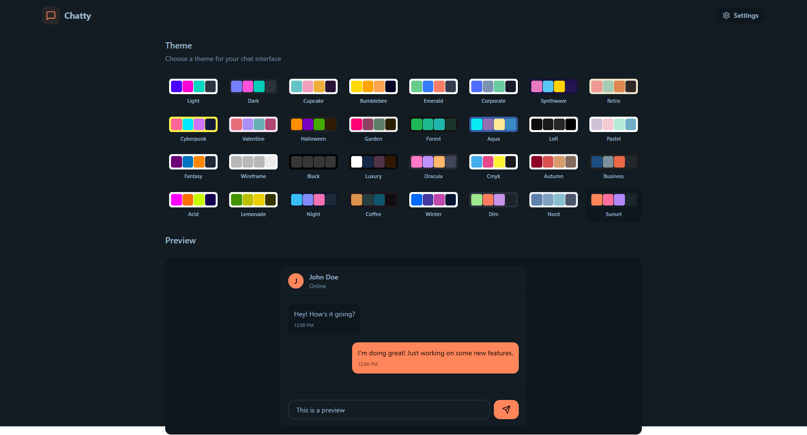
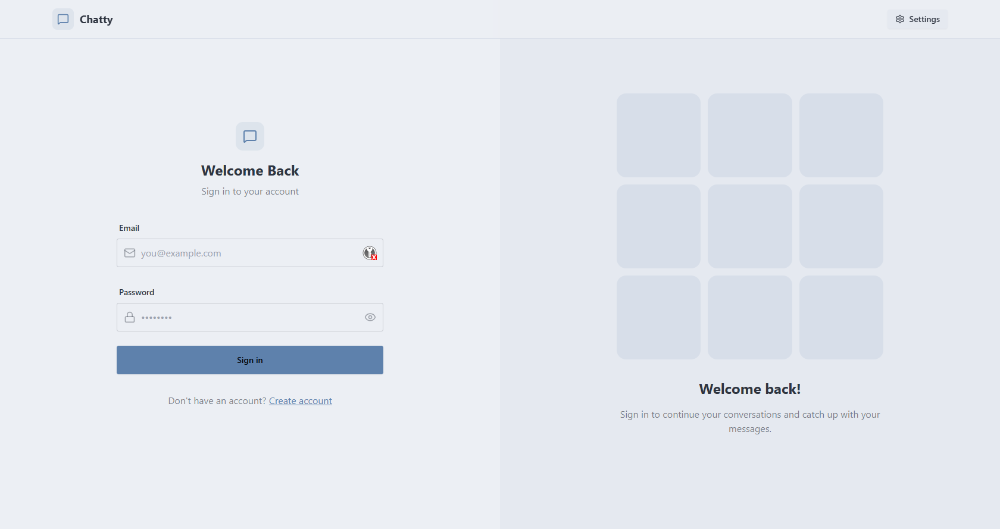
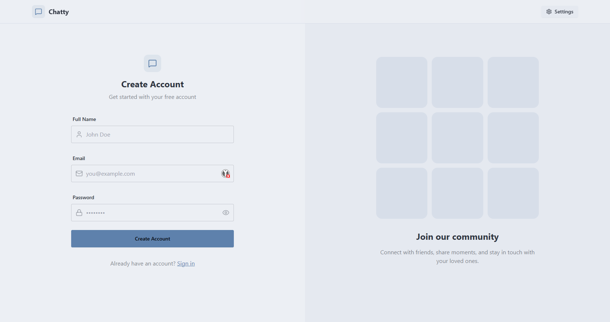
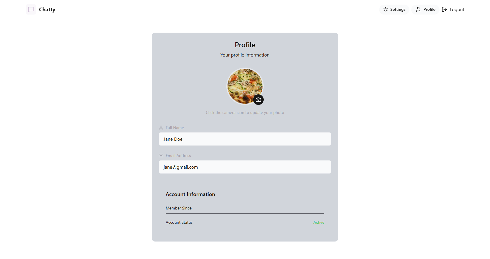
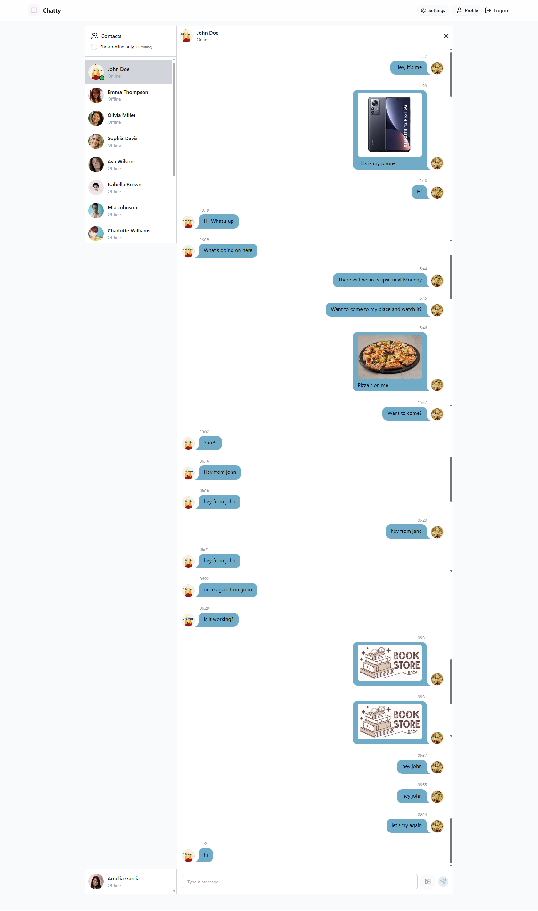

# MERN Stack Project: Realtime Chat App

[Live Demo](https://mern-chat-app-xyx4.onrender.com/)

## Highlights

🌟 **Tech Stack**: MERN + Socket.io + TailwindCSS + Daisy UI  
🎃 **Authentication & Authorization** with JWT  
👾 **Real-time messaging** with Socket.io  
🚀 **Online user status**  
👌 **Global state management** with Zustand

## Screenshots

  
*Realtime Chat App Settings*

  
*Realtime Chat App SignIn*

  
*Realtime Chat App Register*

  
*Realtime Chat App User Profile*

  
*Realtime Chat App Chat Content*

## Features

- **Real-time messaging**: Users can send and receive messages instantly.
- **Authentication & Authorization**: JWT is used to authenticate users and ensure only authorized users can access certain routes.
- **User Profile**: Users can update their profile picture and details.
- **Socket.io**: For establishing a real-time chat connection.
- **Online User Status**: Displays which users are online in real time.

## Setup

To run this project locally, follow these steps:

### Prerequisites

- Node.js
- MongoDB (or use MongoDB Atlas for cloud database)
- Cloudinary account (for image uploads)

### Installation

1. **Clone the repository:**

    ```bash
    git clone https://github.com/gihantha/mern-chat-app.git
    cd mern-chat-app
    ```

2. **Install the dependencies for both frontend and backend:**

    ```bash
    npm install --prefix backend
    npm install --prefix frontend
    ```

3. **Set up environment variables in the `.env` file for both frontend and backend.**

    Here's an example of the `.env` file for the backend:

    ```env
    MONGODB_URI=<your_mongodb_connection_string>
    PORT=5001
    JWT_SECRET=<your_jwt_secret_key>
    CLOUDINARY_CLOUD_NAME=<your_cloudinary_cloud_name>
    CLOUDINARY_API_KEY=<your_cloudinary_api_key>
    CLOUDINARY_API_SECRET=<your_cloudinary_api_secret>
    NODE_ENV=development
    ```

4. **Run the backend and frontend servers:**

    - **In one terminal window, run the backend server:**

      ```bash
      npm run start --prefix backend
      ```

    - **In another terminal window, run the frontend server:**

      ```bash
      npm run dev --prefix frontend
      ```

    Visit `http://localhost:5173` for the frontend and `http://localhost:5001` for the backend API.

---

### Folder Structure


mern-chat-app/
├── .gitignore
├── backend/
│ ├── .gitignore
│ ├── package-lock.json
│ ├── package.json
│ └── src/
│ ├── controllers/
│ │ ├── auth.controller.js
│ │ └── message.controller.js
│ ├── index.js
│ ├── lib/
│ │ ├── cloudinary.js
│ │ ├── db.js
│ │ ├── socket.js
│ │ └── utils.js
│ ├── middleware/
│ │ └── auth.middleware.js
│ ├── models/
│ │ ├── message.model.js
│ │ └── user.model.js
│ ├── routes/
│ │ ├── auth.route.js
│ │ └── message.route.js
│ └── seeds/
│ └── user.seed.js
├── frontend/
│ ├── .gitignore
│ ├── eslint.config.js
│ ├── index.html
│ ├── package-lock.json
│ ├── package.json
│ ├── postcss.config.js
│ ├── public/
│ │ ├── avatar.png
│ │ └── vite.svg
│ ├── README.md
│ ├── src/
│ │ ├── App.css
│ │ ├── App.jsx
│ │ ├── assets/
│ │ │ └── react.svg
│ │ ├── components/
│ │ │ ├── AuthImagePattern.jsx
│ │ │ ├── ChatContainer.jsx
│ │ │ ├── ChatHeader.jsx
│ │ │ ├── MessageInput.jsx
│ │ │ ├── Navbar.jsx
│ │ │ ├── NoChatSelected.jsx
│ │ │ ├── Sidebar.jsx
│ │ │ └── skeletons/
│ │ │ ├── MessageSkeleton.jsx
│ │ │ └── SidebarSkeleton.jsx
│ │ ├── constants/
│ │ │ └── index.js
│ │ ├── index.css
│ │ ├── lib/
│ │ │ ├── axios.js
│ │ │ └── utils.js
│ │ ├── main.jsx
│ │ ├── pages/
│ │ │ ├── HomePage.jsx
│ │ │ ├── LoginPage.jsx
│ │ │ ├── ProfilePage.jsx
│ │ │ ├── SettingsPage.jsx
│ │ │ └── SignUpPage.jsx
│ │ └── store/
│ │ ├── useAuthStore.js
│ │ ├── useChatStore.js
│ │ └── useThemeStore.js
│ ├── tailwind.config.js
│ └── vite.config.js
├── package-lock.json
└── package.json

---

### Usage

- **Authentication**: Users can sign up, log in, and log out using JWT for authentication.
- **Messaging**: After logging in, users can send and receive messages in real time.
- **Profile Management**: Users can update their profile picture using Cloudinary.
- **Theme Changing**: Users can change their themes according to their preference.
- **Socket.io Integration**: The chat app uses Socket.io to establish a real-time connection between users for instant messaging.

---

### Contributing

Feel free to fork the project and make your changes! If you find any bugs or issues, please open an issue on the GitHub repository.

---

### License

This project is licensed under the ISC License.
